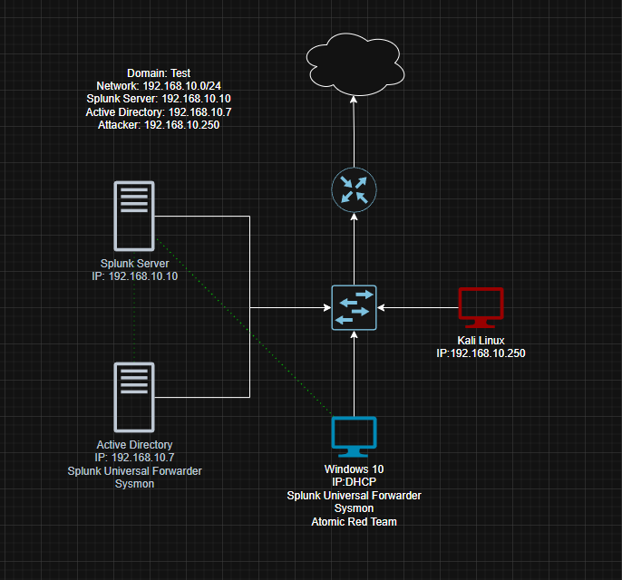

# Active Directory Home Lab

A virtualized home lab simulating an enterprise Active Directory environment with attack simulation and threat detection capabilities. Built using VirtualBox to practice real-world sysadmin and security monitoring workflows.

---

## 🗺️ Network Diagram

### Network Summary

| Host | Role | IP Address |
|------|------|------------|
| Windows Server | Active Directory / Domain Controller | 192.168.10.7 |
| Splunk Server | Log aggregation & SIEM | 192.168.10.10 |
| Windows 10 | Domain-joined target machine | DHCP |
| Kali Linux | Attacker machine | 192.168.10.250 |

**Domain:** Test  
**Network:** 192.168.10.0/24

---

## 🛠️ Tools & Technologies

| Tool | Purpose |
|------|---------|
| **VirtualBox** | Hypervisor — runs all virtual machines |
| **Windows Server** | Active Directory Domain Services (AD DS), DNS, DHCP |
| **Splunk** | SIEM — log ingestion, search, and alerting |
| **Splunk Universal Forwarder** | Ships logs from Windows 10 and AD to Splunk |
| **Sysmon** | Detailed Windows event logging (process creation, network connections, etc.) |
| **Kali Linux** | Attack simulation and penetration testing |
| **Atomic Red Team** | Simulates real adversary techniques mapped to MITRE ATT&CK |

---

## ⚙️ Setup Overview

### 1. VirtualBox Network Configuration
- Created a NAT Network (`192.168.10.0/24`) in VirtualBox to allow all VMs to communicate with each other while remaining isolated from the host network.
- Assigned static IPs to the AD server, Splunk server, and Kali machine; left the Windows 10 target on DHCP.

### 2. Windows Server — Active Directory
- Installed Windows Server and promoted it to a Domain Controller.
- Configured Active Directory Domain Services (AD DS) with the domain `Test`.
- Set up DNS and DHCP scopes to serve the internal network.
- Created organizational units (OUs), user accounts, and applied Group Policy Objects (GPOs).

### 3. Splunk Server
- Deployed Splunk Enterprise on a dedicated VM.
- Configured Splunk to receive log data on port 9997 from forwarders.
- Created indexes and dashboards to monitor Windows event logs and Sysmon telemetry.

### 4. Windows 10 — Target Machine
- Joined the Windows 10 VM to the `Test` domain.
- Installed **Splunk Universal Forwarder** to ship logs to the Splunk server.
- Installed **Sysmon** with a custom configuration to capture detailed endpoint telemetry.
- Installed **Atomic Red Team** for adversary simulation.

### 5. Kali Linux — Attacker Machine
- Assigned a static IP (`192.168.10.250`) on the internal network.
- Used built-in Kali tools to simulate attacks against the Windows 10 target and domain controller.

### 6. Attack Simulation & Detection
- Ran Atomic Red Team tests on the Windows 10 machine to simulate MITRE ATT&CK techniques.
- Launched attacks from Kali Linux targeting the domain environment.
- Monitored Splunk dashboards to verify that Sysmon and Windows event logs captured the activity.
- Investigated alerts and traced attack activity through log analysis.

---

## 🎯 What I Learned

- **Active Directory administration** — building a domain from scratch, managing users, OUs, GPOs, DNS, and DHCP in a Windows Server environment.
- **SIEM fundamentals** — ingesting, indexing, and querying logs in Splunk; building searches to surface suspicious activity.
- **Endpoint telemetry** — configuring Sysmon to capture rich event data and understanding what normal vs. abnormal activity looks like in logs.
- **Adversary simulation** — using Atomic Red Team to map attacks to the MITRE ATT&CK framework and validating that detections fire correctly.
- **Attacker perspective** — operating from Kali Linux to understand how attacks are staged and what artifacts they leave behind.
- **Network design** — planning and configuring an isolated virtual network with static addressing and inter-VM routing.

---

## 📌 References

- [Splunk Documentation](https://docs.splunk.com/)
- [Sysmon — Microsoft Sysinternals](https://learn.microsoft.com/en-us/sysinternals/downloads/sysmon)
- [Atomic Red Team](https://github.com/redcanaryco/atomic-red-team)
- [MITRE ATT&CK Framework](https://attack.mitre.org/)
